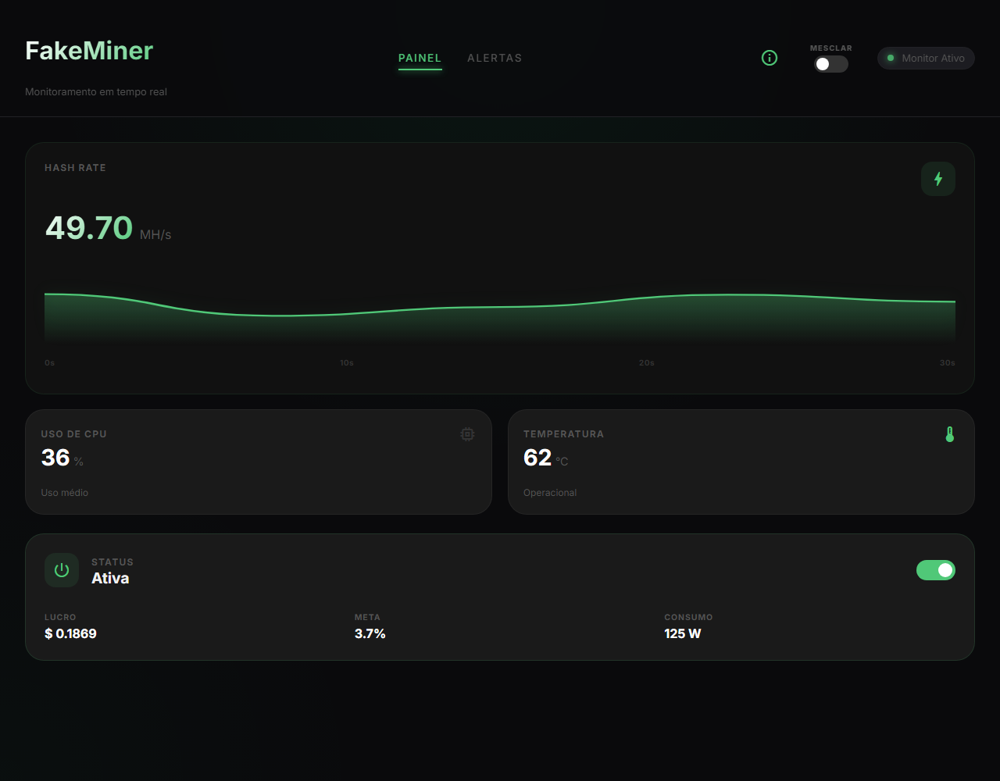
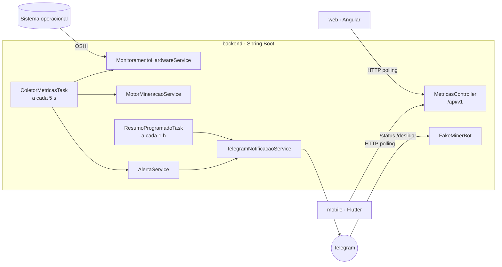
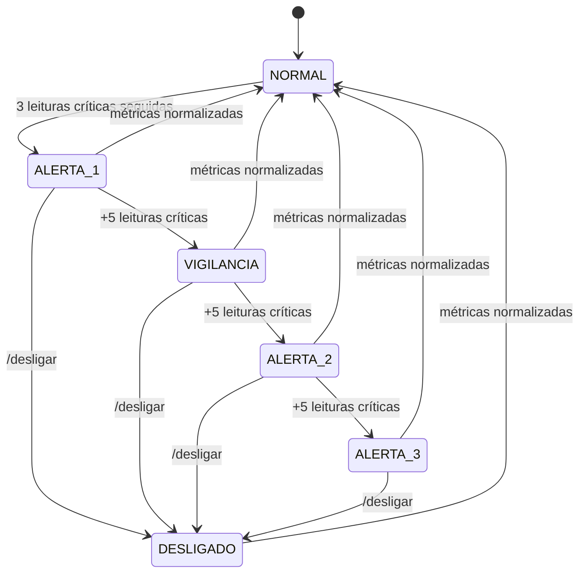

# FakeMiner

[](https://github.com/Lucaskalell/fake-miner/actions/workflows/ci.yml)

Monitor de hardware com um minerador de criptomoedas simulado. A API coleta métricas reais da máquina (CPU, RAM, frequência, uptime), gera métricas fictícias de mineração e dispara alertas escalonados no Telegram quando algo passa do limite. O acompanhamento é feito por um painel web em Angular e por um app Flutter.

Nenhuma mineração acontece de verdade. A ideia é trabalhar os problemas que existem numa operação real (superaquecimento, carga alta, necessidade de intervenção remota) sem gastar hardware com isso.

> **English summary:** FakeMiner is a hardware monitoring system built around a simulated crypto miner. A Spring Boot API collects real machine metrics with OSHI, generates simulated mining data and sends escalating Telegram alerts driven by a state machine. Angular (web) and Flutter (mobile) clients consume the REST API. Code and docs are in Portuguese.



## Estrutura

| Pasta | Stack | Descrição |
|---|---|---|
| [`backend/`](backend) | Java 24, Spring Boot 4, OSHI, TelegramBots | API REST, coleta de métricas, motor de simulação, alertas e bot do Telegram |
| [`web/`](web) | Angular 22, Signals, RxJS | Painel com gráfico de hash rate, controle do minerador e histórico de alertas |
| [`mobile/`](mobile) | Flutter, BLoC, fl_chart | App com as mesmas informações do painel e navegação por abas |

## Arquitetura



A cada 5 segundos o `ColetorMetricasTask` lê o hardware, atualiza a simulação e entrega as duas leituras ao `AlertaService`. Os clientes web e mobile consultam a API por polling (2 s no web, 5 s no mobile).

### Alertas

Os alertas seguem uma máquina de estados para evitar tanto o spam de notificações quanto a falta de reação a um problema que persiste:



Uma leitura é crítica quando a temperatura passa de 85 °C, a CPU de 90% ou a RAM de 85%. Exigir três leituras seguidas antes do primeiro alerta evita que um pico de poucos segundos (abrir um navegador, por exemplo) gere notificação. Cada transição é registrada no histórico, exposto em `GET /api/v1/alertas`, com limite de 100 itens em memória.

### Bot do Telegram

| Comando | Ação |
|---|---|
| `/status` | Métricas de hardware e do minerador |
| `/temps` | Temperatura e uso de CPU |
| `/vigilancia` | Entra em vigilância constante |
| `/desligar` | Desliga o minerador |

O bot só responde ao chat configurado em `TELEGRAM_CHAT_ID`. Mensagens de qualquer outro chat são ignoradas e registradas no log.

## API

Base: `http://localhost:8080/api/v1`

| Método | Rota | Retorno |
|---|---|---|
| `GET` | `/metricas` | Hardware e minerador em uma única resposta |
| `GET` | `/metricas/hardware` | Somente hardware |
| `GET` | `/metricas/minerador` | Somente minerador |
| `POST` | `/minerador/alternar` | Liga ou desliga o minerador e retorna o novo status |
| `GET` | `/alertas` | Histórico de alertas |

<details>
<summary>Exemplo de resposta de <code>GET /metricas</code></summary>

```json
{
  "hardware": {
    "temperaturaCpu": 58.4,
    "usoCpu": 37.3,
    "frequenciaCpuGhz": 3.59,
    "memoriaUsadaGb": 10.39,
    "memoriaTotalGb": 15.94,
    "percentualMemoriaUsada": 65.17,
    "swapUsadaGb": 0.14,
    "uptimeSegundos": 592548
  },
  "mineracao": {
    "ativo": true,
    "hashRateAtual": 48.54,
    "hashRateMedio": 50.0,
    "consumoWatts": 127.71,
    "eficiencia": 0.38,
    "lucroEstimadoDolar": 0.06997,
    "progressoMetaDiaria": 1.39,
    "inicioSessao": "2026-05-09T23:11:55"
  }
}
```

</details>

## Como rodar

Pré-requisitos: JDK 24, Node 22+ e Flutter 3.35+.

**Backend**

```bash
cd backend
cp .env.example .env
./mvnw spring-boot:run
```

Preencha o `.env` com o token do bot, o username e o chat ID. Para rodar sem Telegram, defina `TELEGRAM_BOT_HABILITADO=false`. As notificações passam a ir apenas para o log.

**Web**

```bash
cd web
npm install
npm start
```

Acesse `http://localhost:4200`. A URL da API fica em `web/src/environments/environment.ts`.

**Mobile**

```bash
cd mobile
flutter pub get
flutter run --dart-define=API_URL=http://<ip-do-pc>:8080/api/v1
```

Sem o `--dart-define`, o app aponta para `10.0.2.2`, que é o endereço do host visto pelo emulador Android. Em celular físico, use o IP do computador na rede local.

## Testes

```bash
cd backend && ./mvnw verify
cd web && npx ng test --watch=false
cd mobile && flutter test
```

O pipeline do GitHub Actions roda build, análise estática e testes dos três módulos a cada push.

## Decisões técnicas

**Temperatura simulada.** O OSHI lê temperatura no Windows pela interface WMI `MSAcpi_ThermalZoneTemperature`, que não é exposta por boa parte das placas-mãe. Nos testes ela retornou `0.0` mesmo com privilégio de administrador e com o LibreHardwareMonitor em execução. A temperatura passou a ser derivada do uso real de CPU: parte de 45 °C, sobe proporcionalmente à carga até 85 °C, com amortecimento e ruído de ±1 °C. O resultado acompanha o comportamento térmico da máquina e mantém o fluxo de alertas testável.

**Polling em vez de WebSocket.** Com intervalo de coleta de 5 segundos e um único usuário, polling resolve com menos código. WebSocket está na lista de próximos passos.

**Estado em memória.** Histórico de alertas e estado do minerador vivem na memória da aplicação. Para uma instância monitorando uma máquina, isso basta. Monitorar várias máquinas exigiria persistência e um identificador por máquina.

## Próximos passos

- WebSocket para atualização em tempo real nos clientes
- Monitoramento de várias máquinas
- Persistência do histórico de alertas
- Exportação de métricas para Prometheus e Grafana

## Licença

[MIT](LICENSE)
