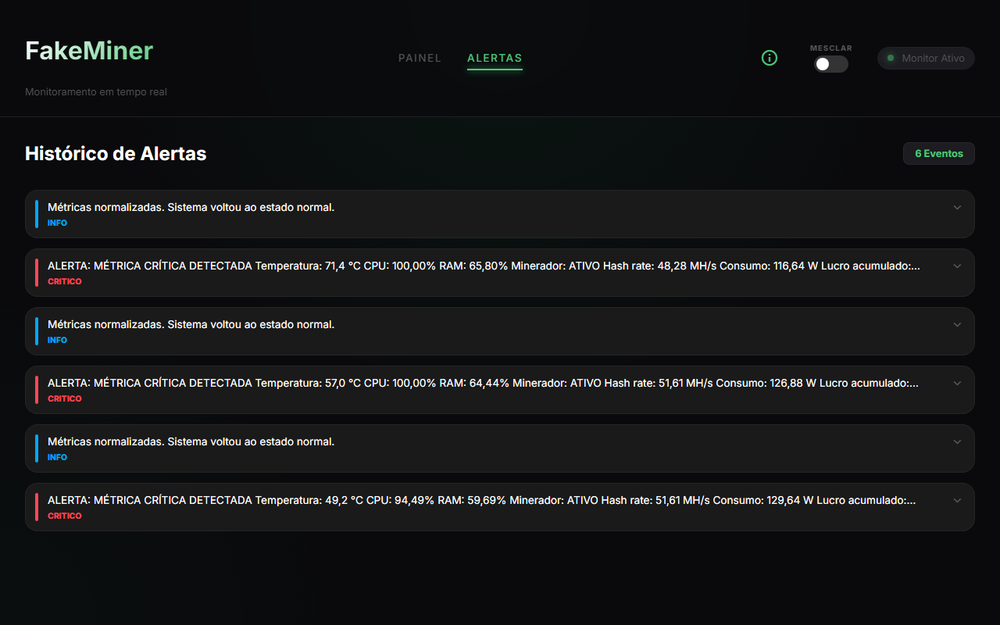

# FakeMiner · web

Painel em Angular 22 com componentes standalone e Signals. Consome a API do [backend](../backend) e mostra hash rate em gráfico SVG, uso de CPU, temperatura, controle do minerador e histórico de alertas. Existe também um modo que junta todas as seções em uma tela só.



## Rodando

```bash
npm install
npm start
```

A URL da API fica em `src/environments/environment.ts`.

## Estrutura

```
src/app
├── components/
│   ├── painel-metricas/     gráfico, cartões de hardware e controle do minerador
│   ├── historico-alertas/   lista de alertas com expansão
│   └── modal-legenda/       explicação de cada métrica
├── models/                  tipos das respostas da API
└── services/                cliente HTTP
```

## Scripts

| Comando | Descrição |
|---|---|
| `npm start` | Servidor de desenvolvimento em `localhost:4200` |
| `npm run build` | Build de produção em `dist/` |
| `npx ng test --watch=false` | Testes com Vitest |
